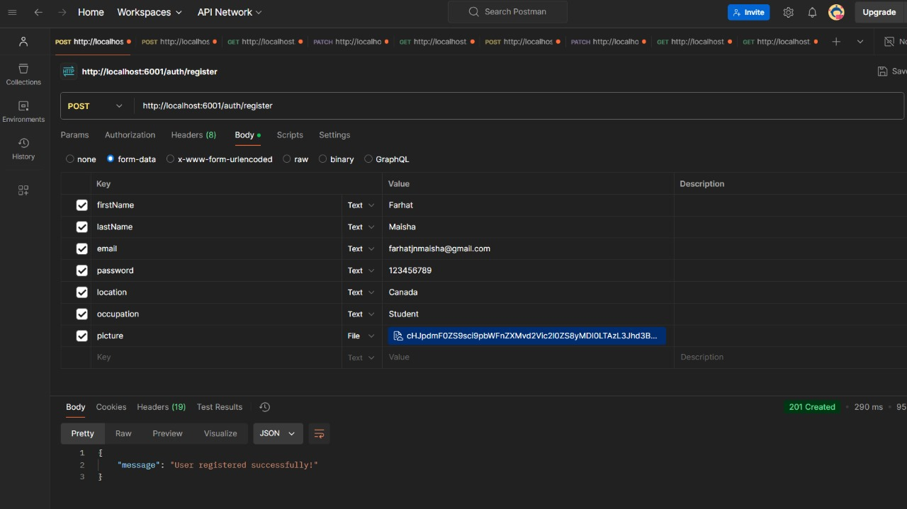
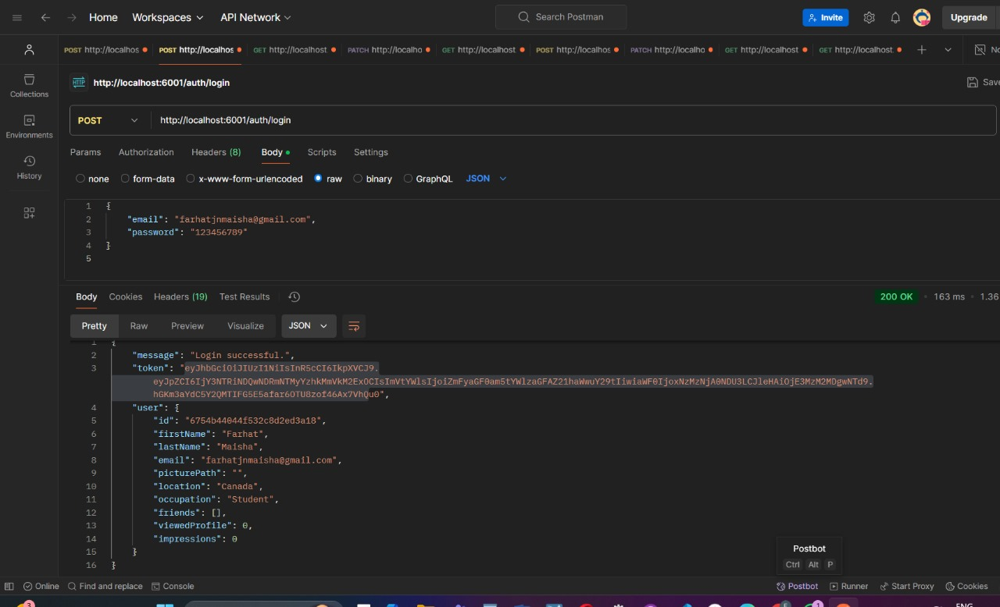
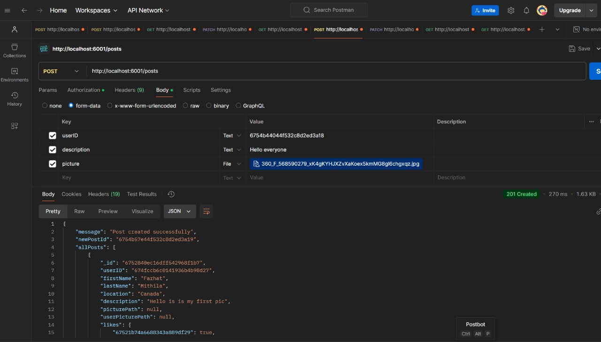
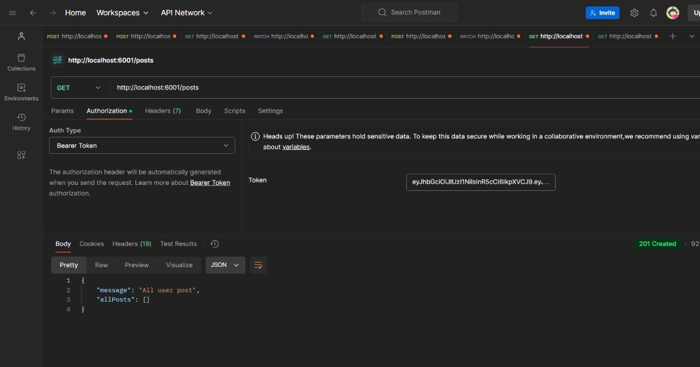
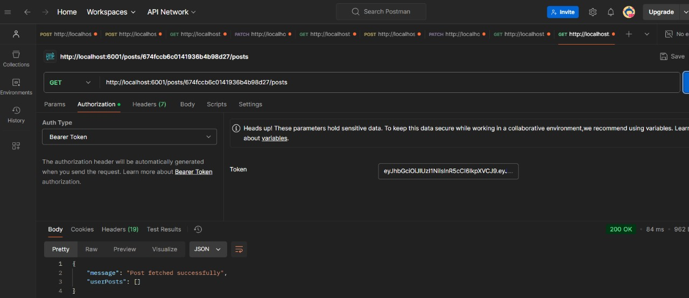
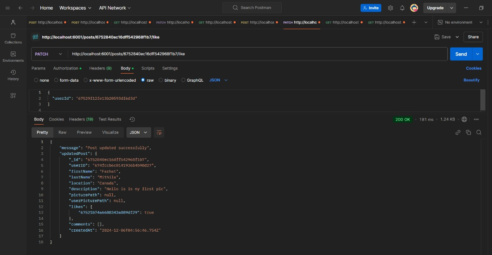
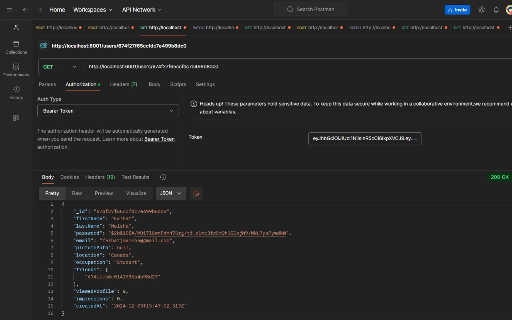
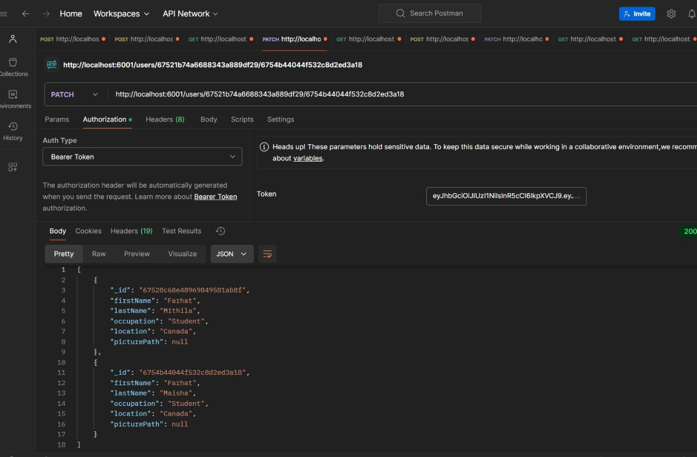

Social_Media_App
 This is the backend implementation for a social media application. The backend handles user authentication, post creation,Like post, user interactions (like adding/removing friends), See friends informations, get other Users posted Feed and other social networking features. It is built using Node.js, Express, MongoDB, and uses Multer for file uploads.

 Features:
. User registration and login (with password hashing and JWT-based authentication).
. File uploads (profile pictures, post images) saved to public/assets.
. Create, read, like/unlike posts.
. Fetch user-specific posts or the general feed.
. Add/remove friends and fetch friend details.
. Validation for user and post data.
. MongoDB integration for persistent data storage.

Setup Instructions:
Prerequisites
Node.js 
MongoDB database

Installation:
1. Clone the Repository
git clone <https://github.com/DrBidoof/Group-Project-COM229_BackEnd>
cd Group-Project-COM229

2.Install Dependencies:
npm install

3.Set Up Environment Variables:
. Create a .env file in the root directory
PORT=6001
connect=mongodb+srv://<username>:<password>@cluster.mongodb.net/Social_Media_App?retryWrites=true&w=majority
JWT_SECRET=your_jwt_secret

Run the Application:
Start the Server
node app.js

Usage Instructions:

1. User Authentication

. Register a User

Endpoint: POST http://localhost:6001/auth/register
Form-data fields:
firstName: User's first name (string)
lastName: User's last name (string)
email: User's email address (string)
password: User's password (string)
picture: Optional profile picture (file)

. Login a User

Endpoint: POST http://localhost:6001/auth/login
JSON Body:
email: User's email address (string)
password: User's password (string)

2. Posts

. Create a Post

Endpoint: POST http://localhost:6001/posts
Requires Bearer Token in the Authorization header.
Form-data fields:
userID: User ID of the person creating the post (string)
description: Description of the post (string)
picture: Optional image to attach to the post (file)

. Get All Posts

Endpoint: GET http://localhost:6001/posts
Requires Bearer Token in the Authorization header.

. Get User Posts

Endpoint: GET http://localhost:6001/posts/:userId/posts
Replace :userId with the actual User ID.
Requires Bearer Token in the Authorization header.

. Like/Unlike a Post

Endpoint: PATCH http://localhost:6001/posts/:id/like
Replace :id with the actual Post ID.
Requires Bearer Token in the Authorization header.
JSON Body:
userId: User ID of the person liking/unliking the post (string)

3. Users

. Get User Details

Endpoint: GET http://localhost:6001/users/:id
Replace :id with the actual User ID.
Requires Bearer Token in the Authorization header.

. Get Friends

Endpoint: GET http://localhost:6001/users/:id/friends
Replace :id with the actual User ID.
Requires Bearer Token in the Authorization header.

. Add/Remove Friend

Endpoint: PATCH http://localhost:6001/users/:id/:friendId
Replace :id with the User ID and :friendId with the Friend's User ID.
Requires Bearer Token in the Authorization header.
